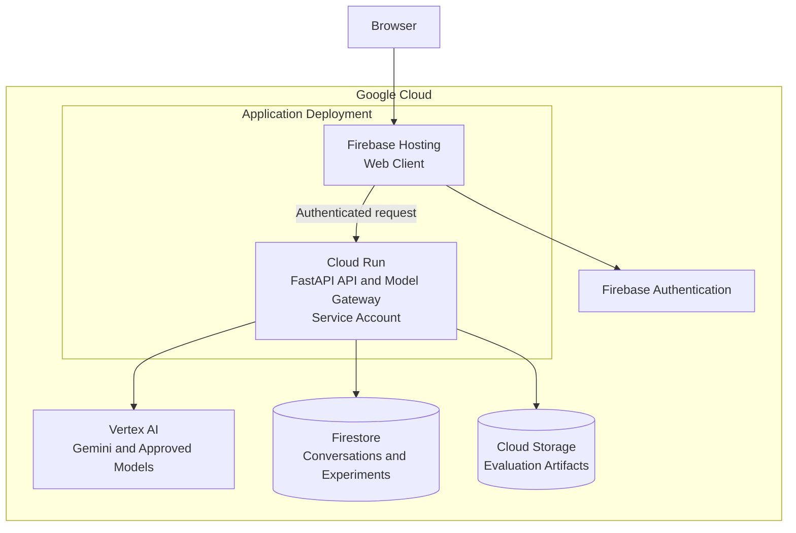

# LLM Platform Engineering Lab

A secure, observable multi-model experimentation platform on Google Cloud. This independent reference implementation reconstructs and extends patterns from an LLM Playground initiative completed for DaVita in January–February 2026.

## Platform scope

The platform gives authenticated users a consistent way to run, compare, and measure approved language models. It keeps application policy, security, data ownership, and provider-specific integration separate.

### Core playground functions

1. **Model selection** — select an approved configuration, such as Gemini Flash, Gemini Pro, or a Vertex-hosted open model.
2. **Experiment configuration** — submit a prompt with controlled generation settings.
3. **Model comparison** — run comparable requests across selected models and configurations.
4. **Response measurement** — return answer content, input tokens, output tokens, estimated cost, and end-to-end latency.
5. **Experiment history** — retain authenticated users' conversations and configurations for later review.

### Platform engineering capabilities

- **Secure access:** Firebase Authentication, backend token validation, Firestore security rules, IAM, and Secret Manager.
- **Model policy:** typed API contracts, approved model routing, parameter validation, and provider adapters.
- **Resilience:** timeouts, retries, fallbacks, rate limits, and circuit-breaker behavior.
- **Observability:** structured logs, trace identifiers, error classification, and operational measurements.
- **Evaluation:** representative cases, quality criteria, and cost/latency comparison.

## Architecture



The web client is deployed as static content through Firebase Hosting; it does not require a container. The reference backend uses one Cloud Run service for the FastAPI API and model gateway. Firebase Authentication supplies user identity, while the Cloud Run service account receives narrowly scoped IAM permissions for Vertex AI, Firestore, Cloud Storage, and runtime secrets.

## Google Cloud foundation

| Layer | Services | Responsibility |
|---|---|---|
| Identity | Firebase Authentication | User sign-in and ID tokens |
| API and model access | Cloud Run, FastAPI, Vertex AI | Token validation, model policy, Gemini and approved-model access |
| Application data | Firestore, Cloud Storage | User-scoped records and controlled artifacts |
| Security and operations | IAM, Secret Manager, Cloud Logging, Trace | Least-privilege access, secrets, auditability, and telemetry |

The [Google Cloud foundation guide](docs/google-cloud-foundation.md) explains the identity, authorization, storage, security, and operational design.

## Project structure

```text
frontend/                         Web client workspace
  src/
    components/                    Shared interface components
    features/{auth,experiments}/   User flows
    services/                      API and Firebase client access
    types/                         Frontend contracts
app/                              FastAPI backend
  api/{routes,schemas}/            HTTP boundary and API contracts
  core/                            Configuration, security, trace context
  domain/{contracts,models}/       Business types and provider-neutral contracts
  services/                        Policy, orchestration, measurement, reliability
  adapters/                        Identity, model, data, storage, observability integrations
infra/                            Firebase, Cloud Run, IAM, Storage, observability configuration
docs/                             Product, architecture, technical design, and planning guides
tests/                            Future unit, integration, contract, and evaluation coverage
```

## Documentation

- [Architecture and service responsibilities](docs/architecture.md)
- [Google Cloud foundation](docs/google-cloud-foundation.md)
- [Product requirements](docs/product-requirements.md)
- [Technical design](docs/technical-design.md)
- [Engineering reference](docs/knowledge-gap-cheatsheet.md)
- [Implementation plan](docs/plan.md)

## Local setup

Requires Python 3.11 or newer.

```bash
python -m venv .venv
source .venv/bin/activate
python -m pip install -e '.[dev]'
cp .env.example .env
uvicorn app.main:app --reload
```

The current application foundation exposes a health endpoint at <http://127.0.0.1:8000/health> and API documentation at <http://127.0.0.1:8000/docs>.
