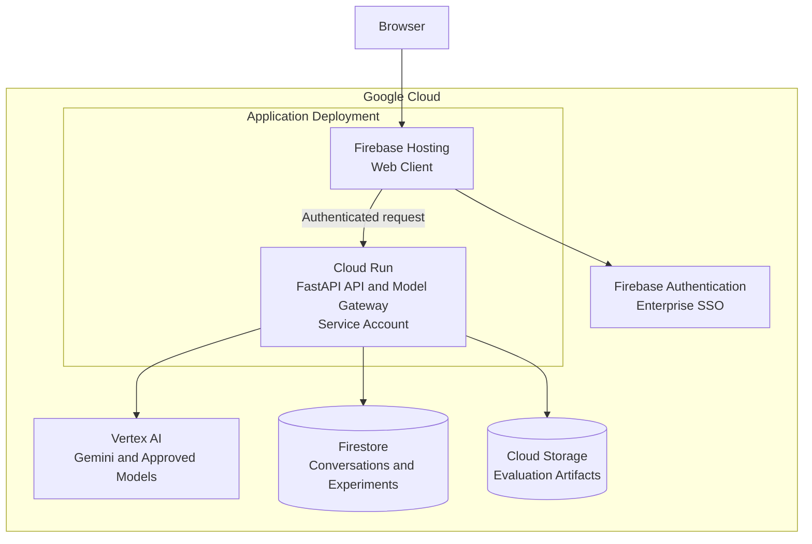

# Architecture

## System view

## Deployment boundary

Firebase Hosting delivers the static web client and does not require a user-managed container. One Cloud Run service contains the FastAPI API and model gateway. This boundary keeps request validation, model policy, response measurement, reliability behavior, and provider adapters together in one independently deployable backend.

The browser never receives provider credentials or privileged Google Cloud permissions. The Cloud Run service uses an attached service account with narrowly scoped IAM access to Vertex AI, Firestore, Cloud Storage, Secret Manager, and observability services.

## Request and identity flow

1. The user signs in through an enterprise identity provider federated to Firebase Authentication.
2. The web client sends the resulting Firebase ID token with the API request.
3. FastAPI validates the token and derives the user identity server-side.
4. The model gateway applies policy, calls the approved Vertex AI model, and measures the request.
5. The API returns generated content plus model, token, cost, latency, trace, and error metadata.
6. Firestore stores user-scoped conversations and experiments; Cloud Storage stores controlled artifacts.

## Application layers

| Layer | Responsibility | Workspace location |
|---|---|---|
| Frontend | Sign-in, experiment input, comparison, and result presentation | `frontend/` |
| API | HTTP routing, authentication boundary, validation, response serialization | `app/api/` |
| Core | Settings, security, shared error handling, and trace context | `app/core/` |
| Domain | Provider-neutral contracts for models, experiments, telemetry, and evaluation | `app/domain/` |
| Services | Model policy, orchestration, measurement, and reliability behavior | `app/services/` |
| Adapters | Vertex AI, Firebase, Firestore, Storage, and observability integrations | `app/adapters/` |
| Infrastructure | Firebase, Cloud Run, IAM, Storage, and operational configuration | `infra/` |

## Core contracts and data

An experiment request contains authenticated identity, a selected approved model configuration, a prompt, generation settings, and optional comparison metadata. An experiment response contains generated content, selected model/configuration, input/output token usage, estimated cost, provider/end-to-end latency, trace identifier, and classified error information when applicable.

Firestore stores user-scoped conversations, experiment records, evaluation results, and audit events. Each record has an owner, timestamps, and an experiment or trace identifier where relevant. Cloud Storage holds controlled evaluation datasets and generated artifacts.

## Google Cloud responsibilities

| Service | Responsibility |
|---|---|
| Firebase Authentication and enterprise SSO | Federated user sign-in and ID tokens |
| Firebase Hosting | Static web-client delivery |
| Cloud Run | FastAPI API, model gateway, and backend runtime identity |
| Vertex AI | Governed Gemini and approved-model access |
| Firestore | User-scoped operational data |
| Cloud Storage | Controlled files and evaluation artifacts |
| IAM and Secret Manager | Least-privilege access and runtime secret isolation |
| Cloud Logging and Trace | Structured operational events and request correlation |

## References

- [Firebase Authentication](https://firebase.google.com/docs/auth)
- [Cloud Firestore](https://firebase.google.com/docs/firestore)
- [Vertex AI documentation](https://cloud.google.com/vertex-ai/docs)
- [Cloud Run documentation](https://cloud.google.com/run/docs)
- [Google Cloud IAM](https://cloud.google.com/iam/docs)
