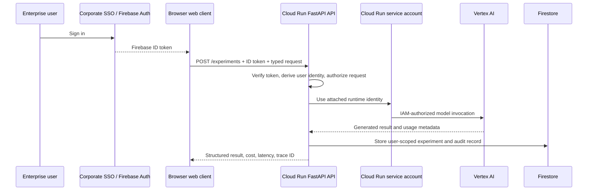

# Identity and Service-Identity Call Chain

## Why this matters

The ESP predictive-maintenance POC demonstrates a **thin service**: typed operational data enters a FastAPI endpoint, the service calls a risk-scoring function, and a response is returned.

This LLM Playground adds the enterprise application layers around the model call. It separates two identities that must never be confused:

1. **User identity** answers: *Who is using the application?*
2. **Workload (service) identity** answers: *What cloud resources is the backend allowed to use?*

The browser never becomes the Cloud Run service account. A signed-in user asks the application to do something; the controlled backend performs the approved work using its own least-privilege runtime identity.

## One experiment request, end to end

## One request, three parallel concerns

There is no conversion from a user identity into a service account. The request carries a signed user token to the API, while Cloud Run already has a service account attached to the running workload.

| Concern | What travels or is used | Where the decision is made |
|---|---|---|
| **User identity** | The browser sends a short-lived Firebase ID token over HTTPS. FastAPI verifies it and derives trusted user, organization, and role claims. | FastAPI application authorization: may this user perform this action or access this record? |
| **Workload identity** | Cloud Run uses its pre-attached service account when the API calls Google Cloud resources. | Google Cloud IAM: may this workload call this model, database, bucket, secret, or key? |
| **Sensitive data protection** | PHI or PII is application data, not identity-token content. It is minimized, redacted from logs, encrypted in transit and at rest, and may require masking or approved decryption. | Application policy, data-governance controls, and where applicable Cloud KMS permissions. |

The same request can therefore retain a verified user context for ownership and audit while the backend uses its separate service account for cloud access. The service account does not replace the user identity.

## The two identity lanes

| Lane | Identity | What it controls | What it must not control |
|---|---|---|---|
| **User lane** | Enterprise user authenticated through corporate SSO and Firebase Authentication | Sign-in, user-specific access, ownership of conversations and experiments | Vertex credentials, application secrets, direct cloud permissions |
| **Workload lane** | Cloud Run service account attached to the FastAPI backend | IAM-authorized calls to Vertex AI, Firestore, Cloud Storage, Secret Manager, Logging, and Trace | Which user is allowed to run an experiment or read another user's history |

The FastAPI backend is the policy boundary between the two lanes. It verifies the user token, applies application authorization and model policy, then uses its service account only for the narrow cloud operations required to fulfill that approved request.

## What happens at each step

1. **Sign in:** Corporate SSO federates to Firebase Authentication. The browser receives a short-lived Firebase ID token.
2. **Call the API:** The browser sends the token and a typed experiment request to `POST /experiments`. It does not send a user ID that it can invent, and it never holds a Vertex credential.
3. **Authenticate and authorize:** FastAPI verifies the token and derives the caller identity server-side. Application policy decides whether that user can run the chosen approved model and access the requested conversation.
4. **Execute with workload identity:** The Cloud Run service uses its attached service account. Google Cloud IAM permits that identity to access only approved resources, such as Vertex AI and the designated Firestore database. The application still applies user, organization, ownership, and purpose checks to every persistence operation.
5. **Return and record:** The backend returns a structured result and stores the experiment, telemetry, and audit metadata. Stored records remain tied to the authenticated user and trace identifier.

## Why the service account is necessary

Vertex AI, Firestore, Cloud Storage, Secret Manager, and observability services are cloud resources. They require a trusted workload identity and IAM permissions. The backend service account is that identity.

The user does **not** receive those permissions. The user receives application access; the backend receives controlled resource access. This design prevents the browser from directly invoking models, reading secrets, or accessing other users' data.

## Minimal least-privilege example

For the first usable Playground release, the Cloud Run service account needs only resource-specific permissions such as:

- invoke approved Vertex AI models;
- access the designated Firestore database only; application code reads and writes only the records permitted for the authenticated user and purpose;
- read designated secrets at runtime, if a provider or integration requires one;
- emit logs and traces.

It should not receive broad project-owner permissions, unrestricted data access, or credentials delivered to the browser.

## Interview explanation

> The user identity and the backend service identity are different on purpose. Firebase Authentication tells my FastAPI service who is using the application. After the service validates and authorizes that request, Cloud Run uses its attached least-privilege service account to call Vertex AI and persist the result. The browser never receives model credentials or cloud permissions.

## Relationship to the FastAPI service path

This document explains the security and identity dimension of the request. The [architecture](architecture.md#reference-backend-service-path) explains the application layers after the request reaches the backend: endpoint, service, model gateway, provider adapter, persistence, and telemetry.
